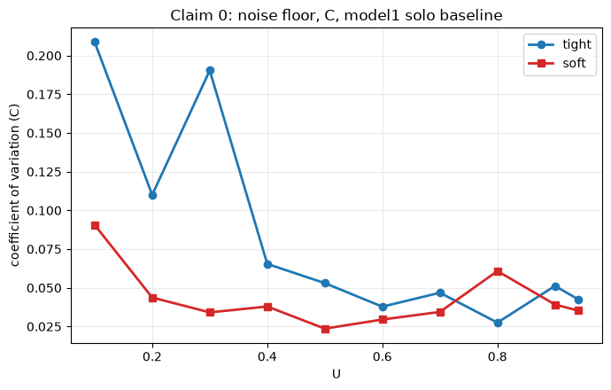
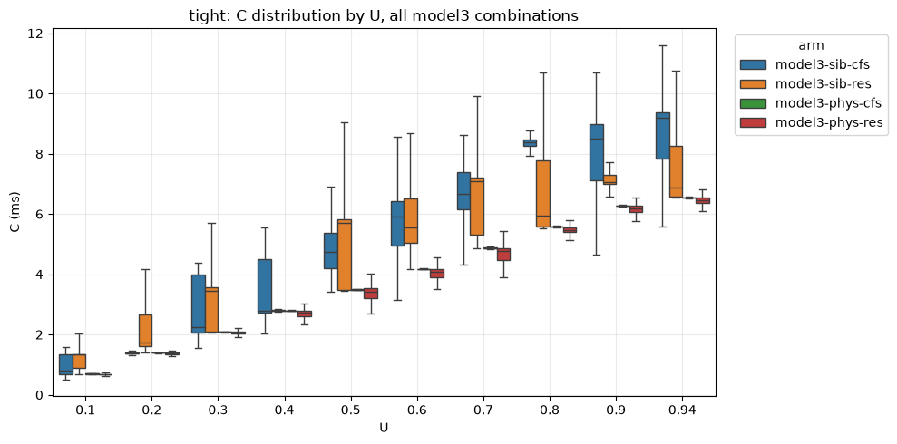
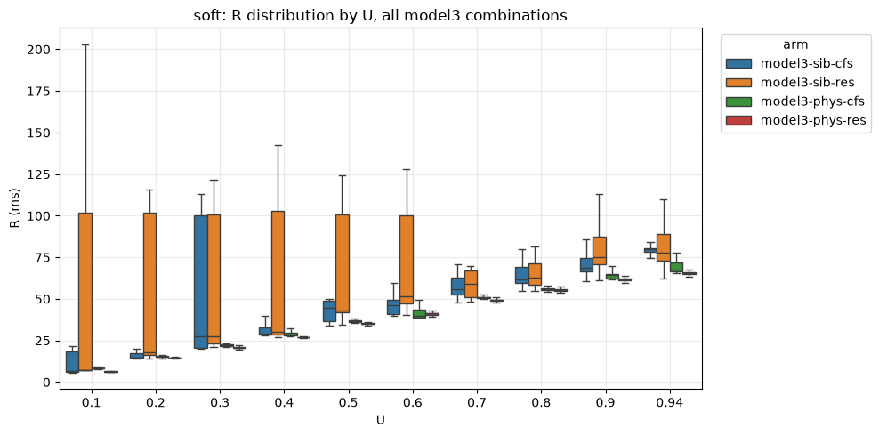

<!--
Render with the "Marp for VS Code" extension (Command Palette -> "Marp: Export
Slide Deck") or marp-cli: marp docs/presentation-2026-09-10.md --pdf
Figures pulled from analysis/analysis.ipynb's rendered outputs on 2026-09-09,
saved under research-questions/RQ1_final/analysis/figures/. Image paths below
are relative to this file (docs/).
-->

# RQ1_final — status for 2026-09-10

Setup, workload, claims tested, results so far. Six models, four rounds each,
5000 jobs per cell, two scales, ten utilization points.

---

## Setup: isolation maxed out on this platform

- Core isolation (`isolcpus`/`nohz_full`/`rcu_nocbs`), frequency pinning,
  systemd cgroup containment, permanent IRQ steering, `mitigations=off`,
  `transparent_hugepage=never`, SMT-aware placement — all applied.
- **PREEMPT_RT investigated and ruled out**: the PREEMPT_RT kernel fails to
  boot on this Azure VM because the Hyper-V drivers don't load under it — a
  platform-level incompatibility, not a configuration issue. Root-caused, not
  a dead end left unexplained.
- What's left after all of the above is treated as this platform's
  **irreducible noise floor** (quantified later in this deck), not a
  configuration gap.

*Talk track:* "This is the ceiling of what OS-level tuning can buy us on
Azure. PREEMPT_RT — the obvious next lever — is structurally unavailable
here, not just untried."

---

## How much the setup actually bought us

| Metric | before | after | change |
|---|---|---|---|
| `nohz_full` tick rate (core2, /sec) | 322 | 0 | −100% |
| non-idle % (60s avg), cores 1–3 | 0.62 / 1.16 / 0.70 | 0 / 0 / 0 | −100% |
| IRQ count Δ/60s, cores 1–3 | 22462 / 26926 / 25845 | 227 / 0 / 0 | −99 to −100% |
| hwlatdetect max latency | 2313 µs | 211 µs | **−90.9%** |
| hwlatdetect samples > threshold | 10 | 5 | −50% |
| syscall overhead (getpid, core2) | 0.082 µs/call | 0.138 µs/call | **+68.7%** |

*Talk track:* "Everything that matters for a compute-bound real-time workload
improved dramatically — isolated cores are essentially silent. The one
regression, syscall overhead, is a known, documented cost of `nohz_full`
(re-arming the tick around every syscall) — a real, understood trade-off, not
a mystery, and irrelevant for our syscall-light workload."

---

## Models and parameters

| Model | Placement | Competitor | Competitor intensity | Purpose |
|---|---|---|---|---|
| **model1** | target alone | — | — | clean baseline / noise floor |
| **model3-phys-cfs** | different physical core | unreserved (CFS) | u=0.4 | does separation alone protect you? |
| **model3-phys-res** | different physical core | reserved (own CBS) | u=0.4 | …regardless of neighbor's class? |
| **model3-sib-cfs** | **SMT sibling** | unreserved (CFS) | u=0.4 | does sharing a core break it? |
| **model3-sib-res** | **SMT sibling** | reserved (own CBS) | u=0.4 | …does the neighbor's own reservation help? |
| **model4** | target + generator thread, distinct physical cores | — | — | periodic vs. event-triggered release (dispatch-jitter isolation) |

- Shared across all: utilization sweep `U ∈ {0.1, …, 0.9, 0.94}`, both
  `tight` (10ms period) and `soft` (100ms period) scales, 4 independently
  launched runs each.
- **Deliberate scoping**: competitor intensity fixed at u=0.4 in every
  model3 arm — isolates *placement* and *competitor scheduling class* as the
  two variables under test, rather than also varying how hard the neighbor
  pushes. Stated here explicitly, not left implicit.

---

## The workload

- Sieve of Eratosthenes over a fixed bound (`workload.c`) — same nested loops
  every job, no data-dependent branching, so compute cost is deterministic by
  construction. Any variability observed is environment, not the workload.
- Two different bounds per scale, deliberately: `tight` stays cache-resident
  (8192 elements, fits L1/L2); `soft` deliberately exceeds this hardware's L2
  (~1M elements) for genuine cache-miss cost. Scale choice is justified by
  cache-hierarchy behavior, not an arbitrary time-magnitude pick.
- Runs under `SCHED_FIFO`, placed inside a KubeDeadline/H-CBS cgroup
  reservation via the same DRA claim path as every other model — not native
  `SCHED_DEADLINE`, so it genuinely exercises H-CBS, not the kernel's own
  EDF class directly.

---

## Claims, expectations, results

| # | Claim | Expectation | Result |
|---|---|---|---|
| 1 | Reservation alone delivers near-promised response time | `R≈C`, near-zero misses outside the noise floor | **Confirmed** |
| 2 | Physical separation isolates regardless of neighbor's class | phys-cfs ≈ phys-res | **Confirmed** — <5% apart at every U |
| 3 | SMT sharing breaks the guarantee | sib-* misses ≫ phys-* | **Confirmed, but bistably** — see next slide |
| 4 | Neighbor's own reservation doesn't protect you once sharing a core | sib-cfs ≈ sib-res | **Confirmed** — no systematic winner |
| 5 | Breakdown is execution-time inflation, not withheld CPU time | Δ-bound holds even where misses occur | **Confirmed** — Δ-violations ≤0.035% everywhere |
| 6 | More slack ⇒ higher mean, lower relative variability | mean R↑, CV↓ with U | **Confirmed** — CV drops 2.6–5× (model1) |
| 7 | Irreducible noise floor persists after full isolation | CV never reaches ~0 | **Confirmed** — floor at CV≈0.035 |

*(Full metric definitions on the next slide; magnitudes on the results
slides that follow.)*

---

## Metrics used, and why

| Metric | Definition | Why tracked |
|---|---|---|
| **C** | thread CPU-time actually consumed | isolates compute cost from delay |
| **R** | wall-clock finish − release | the guarantee's actual pass/fail quantity |
| **dispatch_latency** | start − release | tests the Δ (admission/delay) bound directly |
| **mid_job_preempt** | (finish−start) − C | isolates real scheduling gaps from IPC slowdown |
| **deadline_miss / tardiness** | R > period, and by how much | the literal correctness criterion |
| **CV** | std/mean, per cell | comparable noise measure across scales/U |
| **steal_us** | hypervisor steal time | rules the hypervisor in/out as a cause |
| **α-suspect** | mid_job_preempt > 5%·Q while C < Q | proxy: is the CBS server withholding bandwidth? |
| **Δ-bound violation** | dispatch_latency > 2(P−Q) | falsifies/confirms the paper's own formal bound |

---

## Results — model1 noise floor

| Scale | U=0.1 CV | U=0.94 CV | reduction |
|---|---|---|---|
| tight | 0.209 | 0.043 | ~5× |
| soft | 0.091 | 0.035 | ~2.6× |

  

*Talk track:* "Even solo, fully isolated, variability never disappears — but
it shrinks as utilization (slack) grows. This directly answers last
meeting's question: more slack ⇒ higher mean, but *more* predictable, not
less."

---

## Results — what correlates with the noise floor

Partial correlation with `C`'s variability, controlling for U (model1):

| Candidate cause | vs. absolute noise (std) | vs. relative noise (CV) |
|---|---|---|
| mid-job preemption | r=0.322, p=0.004 | r=0.554, p<0.001 |
| involuntary context switches | r=0.170, p=0.13 (n.s.) | r=0.664, p<0.001 |
| dispatch latency | r=0.290, p=0.010 | r=−0.380, p<0.001 |

*Talk track:* "Preemption and context switches are the significant,
positive drivers of relative noise — dispatch latency actually correlates
*negatively* with CV once U is controlled for. Hypervisor steal was checked
separately and ruled out entirely."

---

## Results — Δ and α across model3

| | Δ-bound violation rate | α-suspect rate (typical) |
|---|---|---|
| phys-cfs / phys-res | ≤0.03% | near-zero |
| sib-cfs / sib-res | ≤0.035% | up to 7.8% (tight, spiky) |

*Talk track:* "Δ — the admission/delay guarantee — holds almost perfectly
**everywhere**, sib arms included. α-suspect (real mid-job scheduling gaps,
not just slower compute) shows up more under SMT sharing but is noisy —
ties into the same bistability shown next, not a separate effect."

---

## Results — model3 deadline-miss rate

First cell (lowest U) where misses appear, soft scale:

| Arm | Miss % | vs. baseline |
|---|---|---|
| sib-cfs | 25.0% | |
| sib-res | 25.1% | ~400× higher |
| phys-cfs | 0.065% | |
| phys-res | 0.055% | |

**But**: this is a pooled average across 4 runs that don't agree with each
other — e.g. sib-cfs tight U=0.1 individually: **65.8% / 0.14% / 0.06% /
99.8%** miss across the 4 runs. Same config, same placement, verified no
retries/stalls. **The system is bistable — near-baseline or near-total
failure, no stable middle ground.**

---

## Results — C and R distributions (model3)

  
  

*Talk track:* "Left (C, tight): sib arms consistently ~25–40% above phys
arms — the inflation itself is reliable. Right (R, soft): sib-arm boxes are
enormous, whiskers running past 100–200ms against a 100ms period — that's
the bistability visible directly in the distribution, not just the
per-round table."

---

## Event vs. periodic activation (model4 vs. model1)

| Scale | U | mean dispatch (periodic) | mean dispatch (event) | p99 (periodic) | p99 (event) |
|---|---|---|---|---|---|
| tight | 0.94 | 28.6 µs | 228.0 µs | 93 µs | 2661 µs |
| soft | 0.94 | 92.7 µs | 2722.9 µs | 233 µs | 32950 µs |

- Compute cost (`C`) essentially unchanged between the two (e.g. soft
  U=0.94: 64.4ms vs 67.4ms) — confirms only the release mechanism differs.
- Deadline-miss rate broadly similar at most U, but tail dispatch latency is
  **8–30× higher on mean, up to ~140× on p99** for event-triggered release.

*Talk track:* "Async, event-triggered release goes through an extra
futex-based wakeup hop (generator thread → target) that scheduled
`clock_nanosleep` release doesn't pay. Compute is untouched — this is purely
a release-mechanism cost, isolated cleanly from the contention story."

---

## Summary

- Physical separation: sufficient, always.
- SMT sharing: breaks the guarantee, but **bistably** — no stable degraded
  mode, worse for planning than a flat elevated rate would be.
- Mechanism: ~25–40% execution-time inflation, **not** a Δ-bound violation —
  the scheduler keeps its promise, the job needs more of what it promised.
- Neighbor's own reservation: doesn't help once sharing a core.
- Noise floor: real, irreducible, but shrinks with slack.
- Release mechanism (event vs periodic): separate, real cost in dispatch-tail
  latency, independent of the contention findings above.

**Next**: RQ3 ranked infrastructure synthesis (per-intervention attribution);
RQ2 resampling design must preserve the bistable structure found here, not
average it away.
