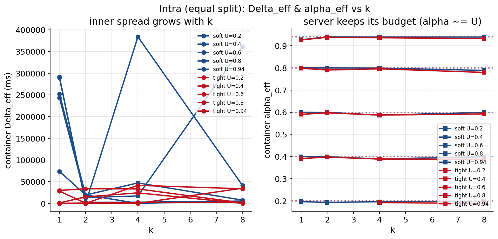
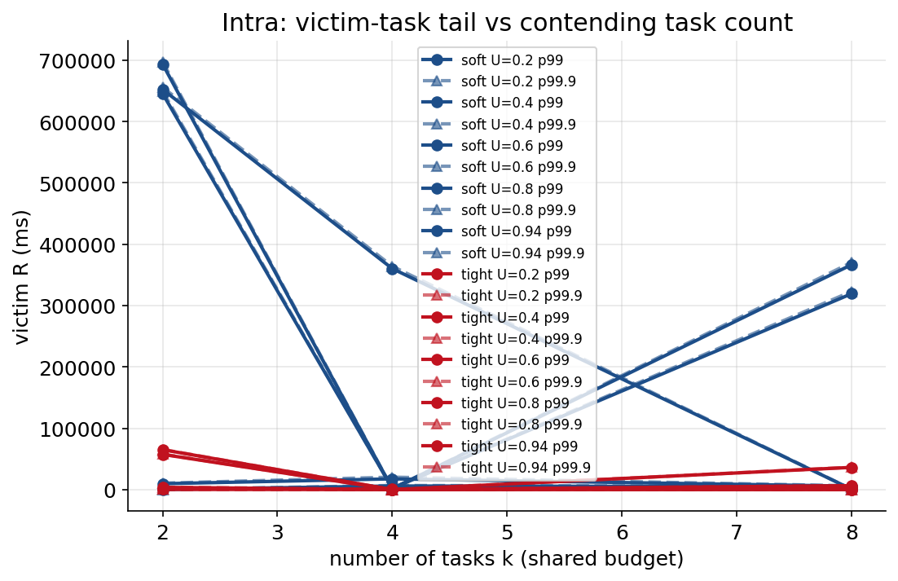
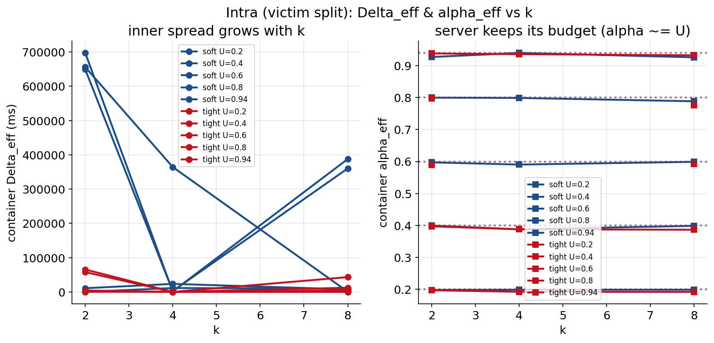
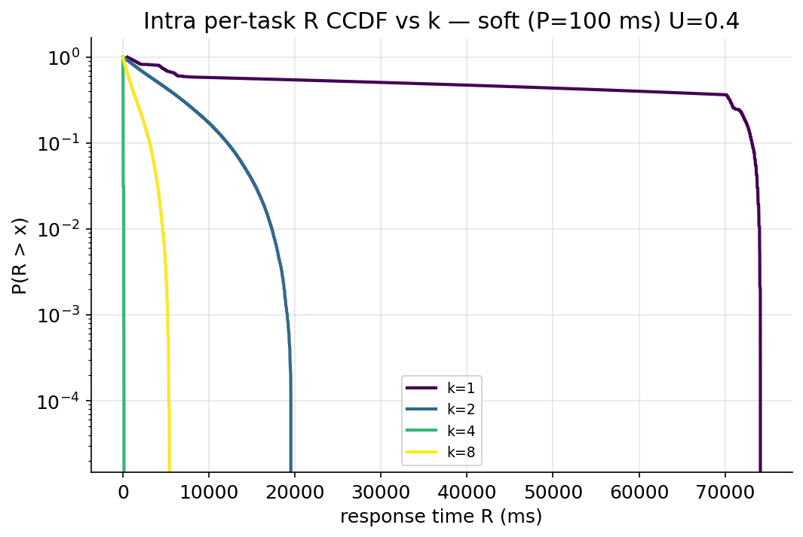
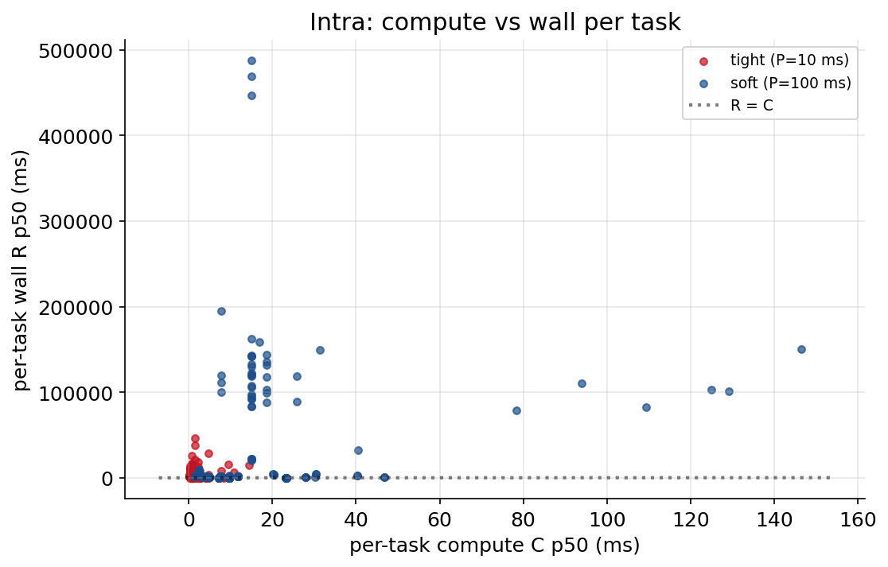
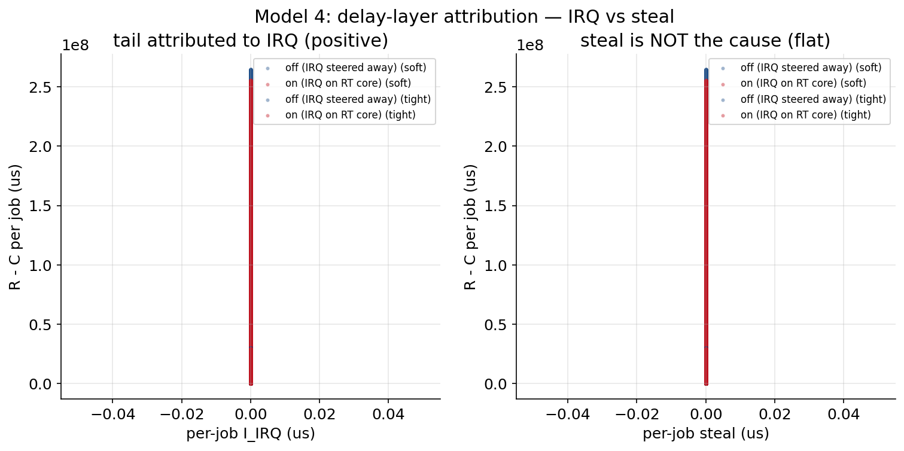
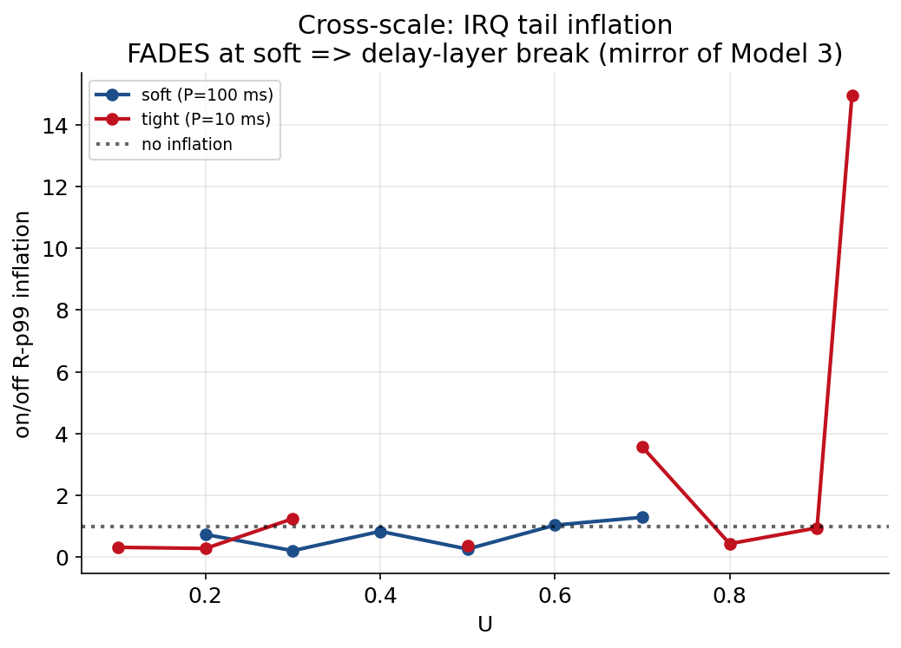
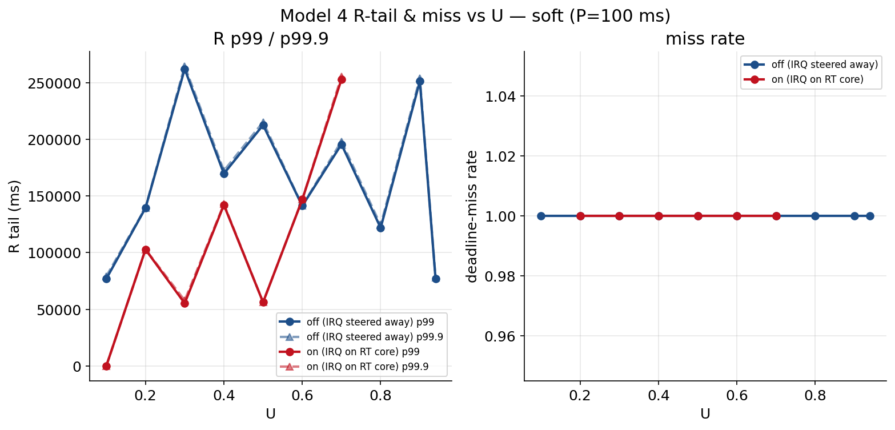
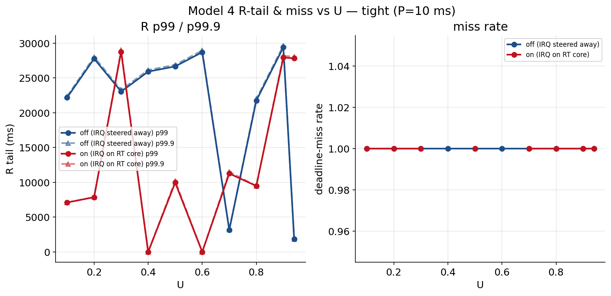

<!--
Render this deck with the "Marp for VS Code" extension (Command Palette ->
"Marp: Export Slide Deck") or marp-cli:  marp docs/presentation-progress.md --pdf
Each slide is 1-2 related figures + a talk-track tagged POSITIVE / NEGATIVE.
Figures are the tracked ones under model2/model4 results (model1_1 results are not
in this clone). Image paths are relative to this file (docs/).
-->

# RQ1 — Does a KubeDeadline reservation deliver real-time on the cloud?

**Method:** one deterministic matmul probe (fixed work, `C ≈ Q`, CV < 2 %) run under
different reservations / neighbours, with a two-clock split
`R − C = dispatch_latency + mid_job_preempt`.

*Talk track:* "Same probe everywhere, so any change in the numbers is the
environment, not the workload. C = CPU time actually used; R = wall-clock guarantee.
The gap between them is where every finding lives."

---

<!-- _class: lead -->
## ✅ WORKS — the container-level firewall holds (Model 2)

  

*Talk track (POSITIVE):* "Right panel — the delivered bandwidth `α_eff` sits exactly
on `U` and stays **flat as I pack k = 1,2,4,8 tasks into one reservation**. The CBS
server gives the container precisely its share regardless of what's inside it. This
is the one guarantee that holds everywhere in the study: **isolation between
containers is real.**"

---

## ❌ DOESN'T WORK — no isolation *inside* a reservation (Model 2)

  
  

*Talk track (NEGATIVE):* "Same budget, but now one greedy task shares it with a small
'victim'. Left: the victim's response-time tail blows up to **hundreds of seconds**.
Right: the server still delivers its `α` — it just doesn't arbitrate *between* tasks.
**Take-away: CBS firewalls the pod, not the tasks inside it.** A positive and a
negative on the same mechanism."

---

## ❌ DOESN'T WORK — running a reservation at 100 % demand diverges (Model 2)

  
  

*Talk track (NEGATIVE, but understood):* "Left CCDF: the k = 1 curve (probe demands its
**whole** budget) stays flat out to ~74 s — unbounded backlog. Right: **C stays flat
and tiny while R explodes** — the damage is 100 % in the delay layer, not compute.
Root cause: calibrating `C ≈ Q` leaves **zero headroom** (ρ≈1, critically loaded), so
any per-job overhead queues forever. **Found it, modelled it, fixed it** with
calibration headroom."

---

## ❌ INVALID (as run) — IRQ steering can't be measured this way (Model 4)

  
  

*Talk track (NEGATIVE):* "Left: the interrupt covariate is **identically zero** in both
arms — every point on the x-axis. Right: the off-vs-on 'inflation' is just scatter
around 1 with one 15× outlier. Two independent reasons it's invalid: **(1)** a
µs-scale IRQ effect is undetectable when R already diverges by tens of seconds
(SNR ≈ 10⁻⁷); **(2)** Azure's managed IRQs aren't steerable, so no interrupt load
ever landed on the core. **A clean negative result under a stated platform limit.**"

---

## ❌ The symptom behind it — 100 % deadline miss at every U (Model 4)

  
  

*Talk track (NEGATIVE, diagnostic):* "Both scales, both arms: **miss-rate pinned at 1.0
across the whole utilisation grid** — even at U = 0.1. That's not an IRQ effect, it's
the same zero-headroom divergence as the previous slide. It tells us the *measurement
floor* is far above the effect we want, so this time-block's model-4 numbers are
**discarded** — but *why* they're invalid is itself the finding."

---

## Status matrix

| Model | Question | Result |
|-------|----------|--------|
| **1_1** | clean baseline noise floor | ❌→🔧 response-time divergence **root-caused & fixed** (zero-headroom + turbo/P-state 1.55×) |
| **2 intra** | isolation between tasks in one reservation | ✅ server firewall holds · ❌ inner starvation |
| **2 inter** | firewall between reservations / over-subscribe | ⏳ re-run (placement fixed: admit target first) |
| **3** | hyper-thread sibling C-inflation | ⏳ not yet run |
| **4** | IRQ steering (delay layer) | ❌ invalid as run → **negative result** (unbounded R + Azure IRQ limit) |

*Talk track:* "Green = a guarantee that holds. Red = a real gap. Every red is
understood, not mysterious. Next: re-run 2-inter and model 3 with the headroom fix,
and close model 4 as a documented platform limitation."
